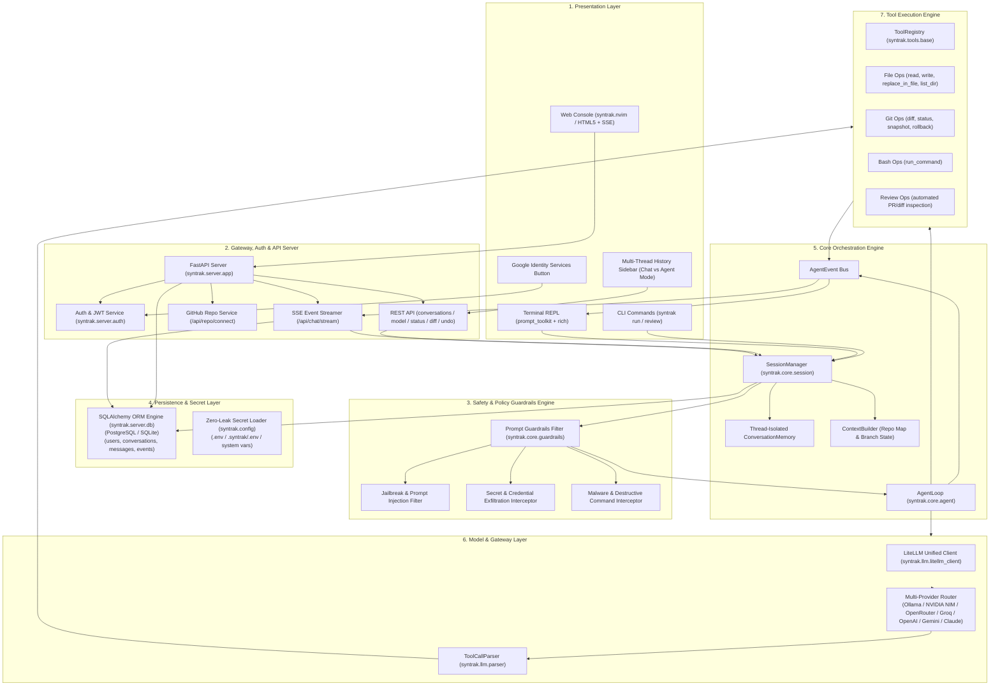
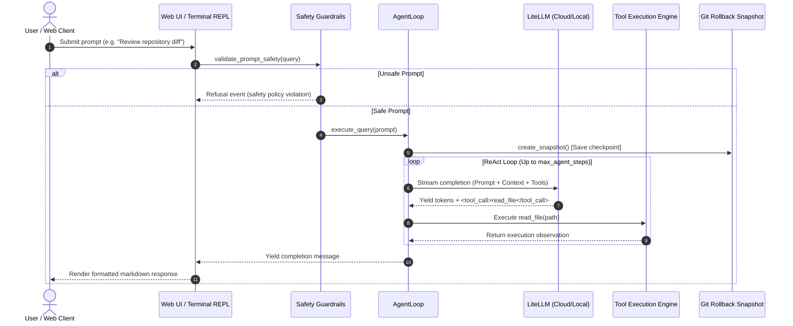

# 🏗️ Syntrak: Architecture & Implementation Plan

> **Terminal-based and web-ready open-source code reviewer & writer assistant**  
> Built for local and cloud models with safe execution bounds, intelligent code modification, multi-database persistence, and real-time streaming interfaces.

---

## 📐 System Architecture Overview

Syntrak is designed with a decoupled, event-driven architecture that cleanly separates the **LLM reasoning engine** from **safety guardrails**, **tool execution**, **session persistence / auth**, and the **presentation layer** (Terminal REPL & Web Console).

---

## 🧩 Architectural Components

### 1. Presentation Layer (`syntrak.ui` & `syntrak.server.static`)
- **Terminal REPL (`syntrak.ui.repl`)**: Interactive command-line environment built on `prompt_toolkit` and `rich`. Features auto-completion, multiline editing, ANSI styling, and command dispatching (`/help`, `/review`, `/diff`, `/undo`, `/model`, `/clear`).
- **Rich Renderer (`syntrak.ui.renderer`)**: Formats agent thoughts, collapsible diff blocks, and streaming code blocks in real-time.
- **Web Console (`syntrak.server.static`)**: Monospace Neovim-styled (`syntrak.nvim`) developer dashboard with:
  - **Multi-Device & Responsive Layout**: Full media query design system supporting desktops, tablets (`<=1024px`), mobile devices (`<=768px`), and small phone viewports (`<=480px`), featuring slide-over touch drawer navigation, backdrop blur, adaptive statuslines, and touch-optimized command inputs.
  - **Dual Mode Toggles**: Instant switching between neutral conversational **Chat Mode** and repository-enabled **Agent Mode**.
  - **ChatGPT-Style Sidebar**: Filtered by active mode, real-time search, date grouping (*Today*, *Yesterday*, *Previous 7 Days*, *Older*), inline title editing, and deletion.
  - **Google Identity Services Integration**: One-click Google Sign-In with dynamic button rendering and user profile card.
  - **Bufferline Tabs**: Real-time `agent.buf` and live provider configuration editor `config.lua`.
  - **5 Selectable Themes**: Gruvbox Dark, Nord, Tokyo Night, Monokai Pro, and Solarized Dark.

---

### 2. Safety & Policy Guardrails Engine (`syntrak.core.guardrails`)
- Intercepts all incoming user queries before LLM invocation:
  - **Prompt Injection & Jailbreaks**: Blocks attempts to bypass system constraints (e.g., `DAN mode`, `ignore previous instructions`, `system prompt override`).
  - **Secret & Credential Exfiltration**: Blocks attempts to dump environment variables, API keys, tokens (`dump os.environ`, `JWT_SECRET`, private keys).
  - **Host Compromise & Destructive Commands**: Blocks destructive shell patterns (`rm -rf /`, `mkfs`, system shutdown).
  - **Malware & Exploit Generation**: Blocks requests for ransomware, keyloggers, and exploit payloads.
- Instantly yields a typed refusal event (`finish_reason="safety_policy_violation"`), saving LLM inference tokens and protecting host infrastructure.

---

### 3. Authentication & Persistence Layer (`syntrak.server.auth` & `syntrak.server.db`)
- **`syntrak.server.auth`**:
  - `verify_google_credential`: Cryptographically validates Google OAuth 2.0 ID tokens.
  - `create_jwt_token` & `decode_jwt_token`: Generates and verifies HMAC-SHA256 JWT tokens.
  - `get_current_user`: FastAPI dependency supporting Authorization headers, HTTP-only cookies, and guest developer fallback.
- **`syntrak.server.db.Database`**:
  - SQLAlchemy 2.0 ORM backend supporting PostgreSQL (via psycopg2) and SQLite with connection pooling, transaction isolation, and automatic migrations:
    - `UserModel` (`users`): User profiles (`id`, `email`, `name`, `picture`, `created_at`).
    - `ConversationModel` (`conversations`): Thread records with `chat_mode` tagging, cascade relations, and subquery message counting.
    - `MessageModel` (`messages`): Multi-turn message storage with markdown content and serialized tool event streams.

---

### 4. Core Orchestration Engine (`syntrak.core`)
- **`SessionManager`**: Coordinates workspace pathing, git state, conversation history, and active LLM configuration across queries.
- **Thread & Workspace Isolation**: Synchronizes in-memory conversation memory (`session.sync_conversation_history()`) per active conversation thread, ensuring zero cross-thread or cross-repository history bleed.
- **`AgentLoop` (ReAct Cycle)**: Implements an iterative **Reasoning + Action** loop:
  1. Compiles dynamic system prompt including workspace structure, git status, and available tool schemas.
  2. Sends message history + context to the active LLM.
  3. Streams response tokens and parses tool invocation blocks (`<tool_call>...<tool_call>`).
  4. Executes the requested tool safely within workspace bounds.
  5. Injects tool output back into conversation memory and continues until completion or `max_agent_steps` limit.
- **`ConversationMemory`**: Manages token-aware message buffers, dynamic context sliding windows, and session clear/reset capabilities.

---

### 5. Model & LLM Gateway (`syntrak.llm`)
- **`LiteLLMClient`**: Abstracted provider layer wrapping LiteLLM to interface uniformly with 100+ local and cloud models (Ollama, NVIDIA NIM, OpenRouter, Groq, OpenAI, Anthropic Claude, Google Gemini, vLLM, LM Studio).
- **`ToolCallParser`**: Robust streaming XML/JSON parser that extracts structured tool calls from raw LLM completions while isolating natural language reasoning.

---

### 6. Tool Execution Engine (`syntrak.tools`)
- **`ToolRegistry`**: Central registration and validation system with automatic JSON schema generation.
- **`file_ops`**: `read_file`, `write_file`, `replace_in_file` (targeted search-and-replace chunk editing), `list_dir`, `search_files`.
- **`git_ops`**: `git_diff`, `git_status`, `create_snapshot`, `rollback_snapshot` (powers `/undo`).
- **`bash_ops`**: Safe command execution inside the user's workspace directory with timeout guards.
- **`review_ops`**: Automated code review module analyzing working diffs or recent commit ranges for vulnerabilities and fixes.

---

## 🔄 Agent Execution Lifecycle

---

## 🗺️ Implementation Plan & Roadmap

### Phase 1: Core Engine & Multi-Provider REPL ✅
- [x] Python project structure with `pyproject.toml` and CLI entry points.
- [x] Multi-provider LLM client integration using `litellm`.
- [x] ReAct agent execution loop with step bounding and streaming callbacks.
- [x] Terminal REPL with `prompt_toolkit`, `rich` syntax highlighting, and slash commands (`/review`, `/diff`, `/undo`, `/model`, `/clear`).
- [x] Core tools: `read_file`, `write_file`, `replace_in_file`, `list_dir`, `run_command`, `git_diff`.
- [x] Git snapshot and rollback system (`/undo`).

### Phase 2: Web Console & Streaming Backend ✅
- [x] FastAPI server (`syntrak serve`) with CORS and REST API endpoints.
- [x] Server-Sent Events (SSE) streaming endpoint (`/api/chat/stream`) for real-time agent output.
- [x] Neovim-themed Monospace Web Console (`syntrak.nvim`) with bufferline navigation tabs.
- [x] 5 classic themes (Gruvbox Dark, Nord, Tokyo Night, Monokai Pro, Solarized Dark).
- [x] Automated PR/Diff code review tools.

### Phase 3: Packaging & Production Deployment ✅
- [x] PyPI packaging configuration with `setuptools` and `MANIFEST.in` static asset bundling.
- [x] Automated test suite with `pytest` and `pytest-asyncio`.
- [x] Cloud deployment blueprint (`render.yaml`) and Docker specifications.
- [x] Automated 24/7 keep-alive GitHub Actions workflow (`keep-alive.yml`).
- [x] Live public demo setup at [syntrak.harsh-shah.me](https://syntrak.harsh-shah.me).

### Phase 4: Google Auth, Multi-Database Persistence & Safety Guardrails ✅
- [x] Google OAuth 2.0 Identity Services authentication with backend token validation.
- [x] JWT sessions with HTTP-only cookies and guest developer fallback.
- [x] ChatGPT-style collapsible sidebar with real-time thread search, date grouping, renaming, and deletion.
- [x] Multi-database support: PostgreSQL and SQLite with automatic migration and connection pooling.
- [x] Multi-layer prompt safety guardrail engine blocking injections, secret exfiltration, and malware.
- [x] Dual operating modes: Neutral ChatGPT-like Chat Mode & Autonomous Agent Mode with dynamic GitHub repository cloning.
- [x] Isolated session memory per thread and workspace to eliminate cross-repo context leaks.

---

## 🔒 Safety & Sandboxing Principles

1. **Safety Guardrails Pre-Filter**: Prompt inputs are pre-screened to reject jailbreaks, credential exfiltration, and malicious requests before consuming model inference.
2. **Workspace Containment**: Tools are strictly confined within the configured workspace directory.
3. **Deterministic Search-and-Replace**: The `replace_in_file` tool requires exact line matching to prevent hallucinated rewrites.
4. **Automatic Git Checkpointing**: Git tree snapshots are captured before mutating changes, ensuring safe one-command rollbacks (`/undo`).
