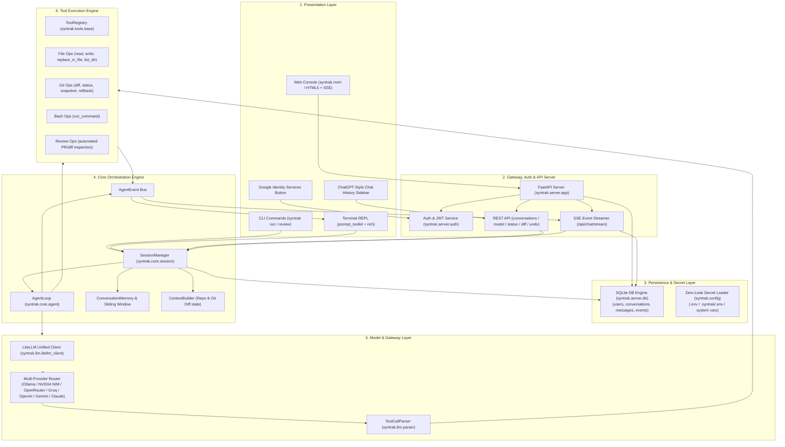
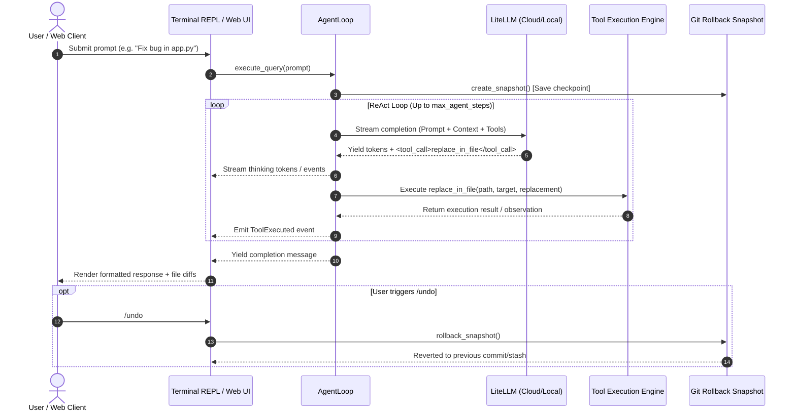

# 🏗️ Syntrak: Architecture & Implementation Plan

> **Terminal-based and web-ready open-source code reviewer & writer assistant**  
> Built for local and cloud models with safe execution bounds, intelligent code modification, and real-time streaming interfaces.

---

## 📐 System Architecture Overview

Syntrak is designed with a decoupled, event-driven architecture that separates the **LLM reasoning engine** from **tool execution**, **session persistence / auth**, and the **presentation layer** (Terminal REPL & Web Console).

---

## 🧩 Architectural Components

### 1. Presentation Layer (`syntrak.ui` & `syntrak.server.static`)
- **Terminal REPL (`syntrak.ui.repl`)**: Interactive command-line environment built on `prompt_toolkit` and `rich`. Features auto-completion, multiline editing, ANSI styling, and command dispatching (`/help`, `/review`, `/diff`, `/undo`, `/model`, `/clear`).
- **Rich Renderer (`syntrak.ui.renderer`)**: Formats agent thoughts, tool execution cards, collapsible diff blocks, and streaming code blocks in real-time.
- **Web Console (`syntrak.server.static`)**: High-density monospace Neovim-styled (`syntrak.nvim`) developer dashboard with:
  - Collapsible **ChatGPT-Style History Sidebar** with real-time thread search, date grouping (*Today*, *Yesterday*, *Previous 7 Days*, *Older*), inline title editing, and deletion.
  - **Google Identity Services Integration** with dynamic button rendering and user profile card.
  - 3 primary bufferline tabs (`agent.buf`, `review.diff`, `config.lua`) and 5 selectable color schemes (Gruvbox, Nord, Tokyo Night, Monokai Pro, Solarized Dark).

---

### 2. Authentication & Persistence Layer (`syntrak.server.auth` & `syntrak.server.db`)
- **`syntrak.server.auth`**:
  - `verify_google_credential`: Cryptographically verifies Google OAuth 2.0 ID tokens against Google's public keys.
  - `create_jwt_token` & `decode_jwt_token`: Generates and verifies HMAC-SHA256 JWT tokens.
  - `get_current_user`: FastAPI dependency supporting Authorization headers, HTTP-only cookies, and guest local fallback.
- **`syntrak.server.db.Database`**:
  - SQLite backend (`~/.syntrak/syntrak.db`) managing relational tables with foreign keys:
    - `users`: Google user profiles (`id`, `email`, `name`, `picture`, `created_at`).
    - `conversations`: Thread records (`id`, `user_id`, `title`, timestamps).
    - `messages`: Multi-turn turns storing role (`user` / `assistant`), text markdown, and serialized tool/thought event streams.

---

### 3. Core Orchestration Engine (`syntrak.core`)
- **`SessionManager`**: Coordinates workspace pathing, git state, conversation history, SQLite persistence, and active LLM configuration across queries.
- **`AgentLoop` (ReAct Cycle)**: Implements an iterative **Reasoning + Action** loop:
  1. Compiles dynamic system prompt including workspace structure, git status, and available tool schemas.
  2. Sends message history + context to the active LLM.
  3. Streams response tokens and parses tool invocation blocks (`<tool_call>...<tool_call>`).
  4. Executes the requested tool safely and obtains observation output.
  5. Injects tool output back into conversation memory and continues until task completion or `max_agent_steps` limit.
- **`ConversationMemory`**: Manages token-aware message buffers, dynamic context trimming, and session clear/reset capabilities.
- **`ContextBuilder`**: Gathers working directory tree, active branch name, unstaged/staged diffs, and project metadata into LLM prompts.

---

### 4. Model & LLM Gateway (`syntrak.llm`)
- **`LiteLLMClient`**: Abstracted provider layer wrapping LiteLLM to interface uniformly with 100+ local and cloud models (Ollama, NVIDIA NIM, OpenRouter, Groq, OpenAI, Anthropic Claude, Google Gemini, vLLM, LM Studio).
- **`ToolCallParser`**: Robust streaming XML/JSON parser that extracts structured tool calls from raw LLM completions while isolating natural language reasoning.

---

### 4. Tool Execution Engine (`syntrak.tools`)
- **`ToolRegistry`**: Central registration and validation system with automatic JSON schema generation for system prompts.
- **`file_ops`**:
  - `read_file`: Line-bounded and offset-bounded file reading.
  - `write_file`: Whole-file creation or overwrite with automatic parent directory creation.
  - `replace_in_file`: Targeted search-and-replace chunk editing for precision code modification without full file rewrites.
  - `list_dir` & `search_files`: Workspace navigation and pattern matching.
- **`git_ops`**:
  - `git_diff` & `git_status`: Real-time inspection of repository state.
  - `create_snapshot` & `rollback_snapshot`: Automated git tree checkpointing that powers `/undo`.
- **`bash_ops`**: Safe command execution inside the user's workspace directory with timeout guards.
- **`review_ops`**: Automated code analysis module that constructs specialized review prompts over working diffs to detect security vulnerabilities, logic flaws, and syntax errors.

---

## 🔄 Agent Execution Lifecycle

---

## 🗺️ Implementation Plan & Roadmap

### Phase 1: Core Engine & Multi-Provider REPL ✅
- [x] Python project structure with `pyproject.toml` and CLI entry points.
- [x] Multi-provider LLM client integration using `litellm`.
- [x] ReAct agent execution loop with step bounding and streaming callbacks.
- [x] Terminal REPL with `prompt_toolkit`, `rich` syntax highlighting, and slash commands (`/review`, `/diff`, `/undo`, `/model`, `/clear`).
- [x] Core tools: `read_file`, `write_file`, `replace_in_file`, `list_dir`, `run_command`, `git_diff`.
- [x] Git snapshot and rollback system (`/undo`).

### Phase 2: Web Console & Streaming Backend ✅
- [x] FastAPI server (`syntrak serve`) with CORS and REST API endpoints.
- [x] Server-Sent Events (SSE) streaming endpoint (`/api/chat/stream`) for real-time agent output.
- [x] Neovim-themed Monospace Web Console (`syntrak.nvim`) with bufferline navigation tabs.
- [x] 5 classic themes (Gruvbox Dark, Nord, Tokyo Night, Monokai Pro, Solarized Dark).
- [x] Automated PR/Diff code review web panel.

### Phase 3: Packaging & Production Deployment ✅
- [x] PyPI packaging configuration with `setuptools` and `MANIFEST.in` static asset bundling.
- [x] Automated test suite with `pytest` and `pytest-asyncio`.
- [x] Cloud deployment blueprint (`render.yaml`) and Docker specifications.
- [x] Automated 24/7 keep-alive GitHub Actions workflow (`keep-alive.yml`).
- [x] Live public demo setup at [syntrak.harsh-shah.me](https://syntrak.harsh-shah.me).

### Phase 4: Google Auth, ChatGPT-Style History & Secrets ✅
- [x] Google OAuth 2.0 Identity Services authentication with backend token validation.
- [x] JWT sessions with HTTP-only cookies and guest developer fallback.
- [x] ChatGPT-style collapsible sidebar with real-time thread search, date grouping, renaming, and deletion.
- [x] SQLite relational storage (`syntrak.server.db`) for persistent users, threads, and streaming tool events.
- [x] Automated `.env` file discovery, prioritized variable resolution, and `.env.example` template.

<!-- ### Phase 4: Semantic Context & Tree-Sitter Integration 🔄 (In Progress)
- [ ] Tree-sitter AST parsing for intelligent syntax-aware symbol navigation.
- [ ] Local vector embeddings (e.g. `chromadb` / `fastembed`) for semantic codebase indexing.
- [ ] Project-wide symbol dependency graph analysis for multi-file refactoring.
- [ ] Automatic test runner hook (run tests after agent edits to verify correctness).

### Phase 5: Multi-File Planning & Sub-Agents 📋 (Planned)
- [ ] Multi-agent orchestration (Architect Agent -> Writer Agent -> Reviewer Agent).
- [ ] Interactive plan-mode confirmation before applying batch file modifications.
- [ ] Background task execution with async cancellation and progress tracking.

### Phase 6: IDE & Editor Ecosystem 📋 (Planned)
- [ ] VS Code Extension (Sidecar communication with `syntrak serve`).
- [ ] Native Neovim plugin (`syntrak.nvim` via Lua RPC).
- [ ] JetBrains IDE plugin. -->

---

## 🔒 Safety & Sandboxing Principles

1. **Explicit Working Directory Bounds**: Tools are strictly confined within the configured workspace root to prevent unintended file modifications.
2. **Deterministic Search-and-Replace**: The `replace_in_file` tool requires exact line matching, preventing hallucinated file rewrites.
3. **Automatic Git Checkpointing**: Before executing mutating actions, git tree snapshots are captured, ensuring safe one-command rollbacks (`/undo`).
4. **Transparent Tool Tracing**: All tool calls and stdout/stderr outputs are rendered with clear visual differentiation before subsequent actions take place.
